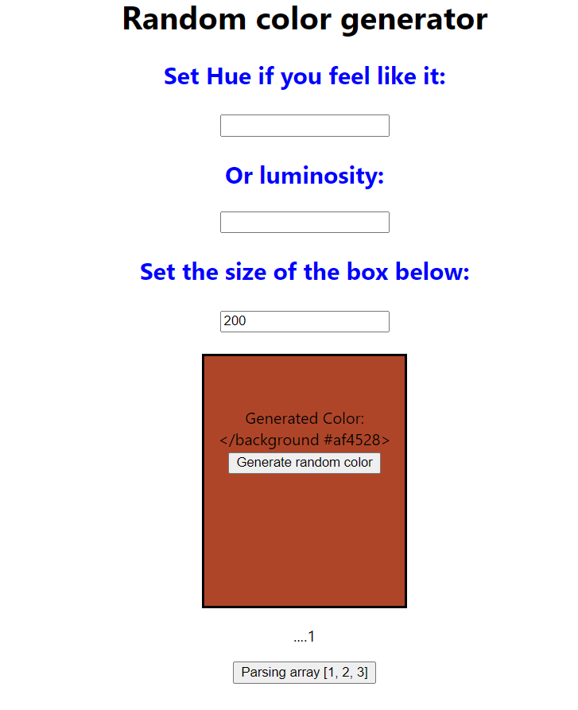

# Random color generator

A little excercise in generating random color for Box element. This file contains following functionalities:

## Input fields (please, type in)

- set Hue (defaultly not set)
- set Luminosity (defaultly not set)

(if none of those is set the random color is generated)

- set the Box Height (default set to 200 px)

## Buttons

- Generate random color
- Parsing array (there is an array of [1, 2, 3] and this button is parsing throught it)

All changes of the Box element are changing using animated transitions.

